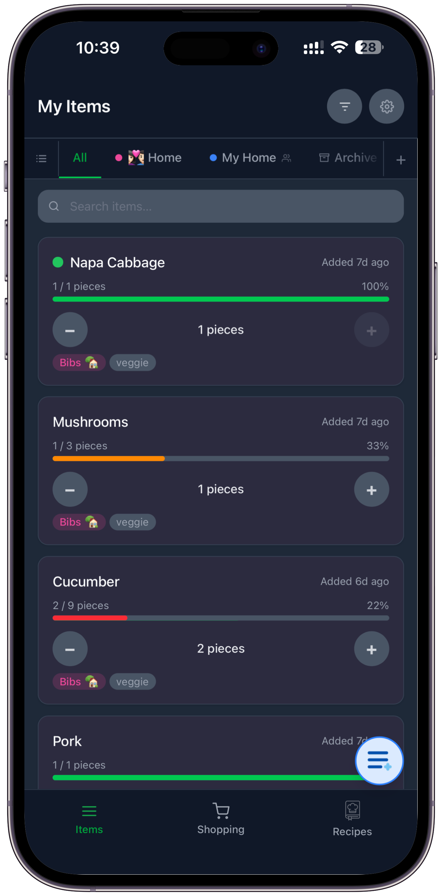
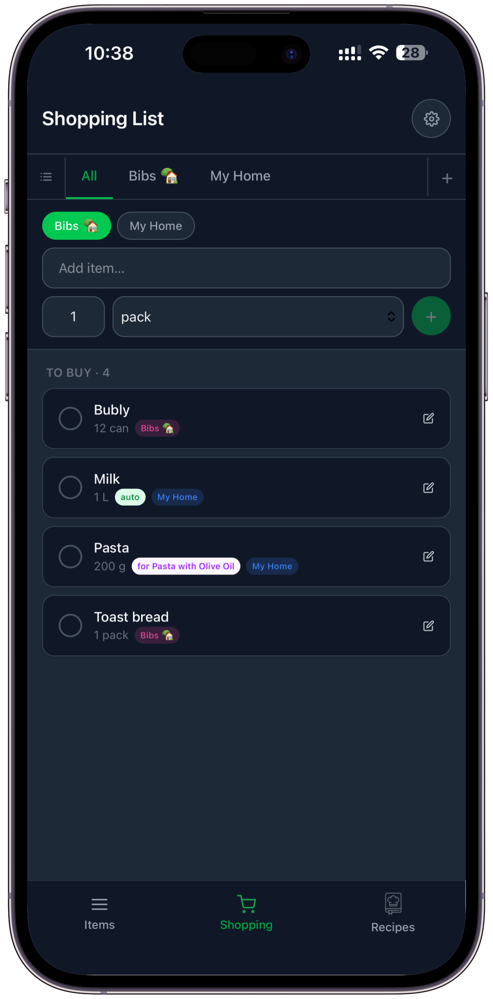
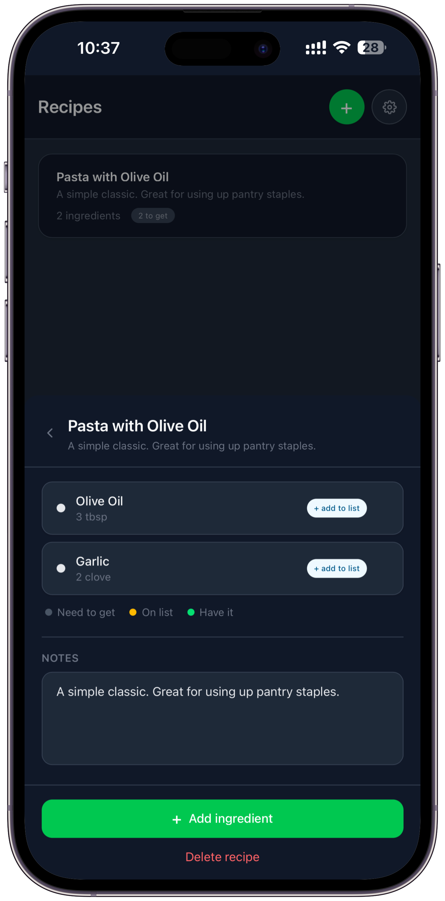
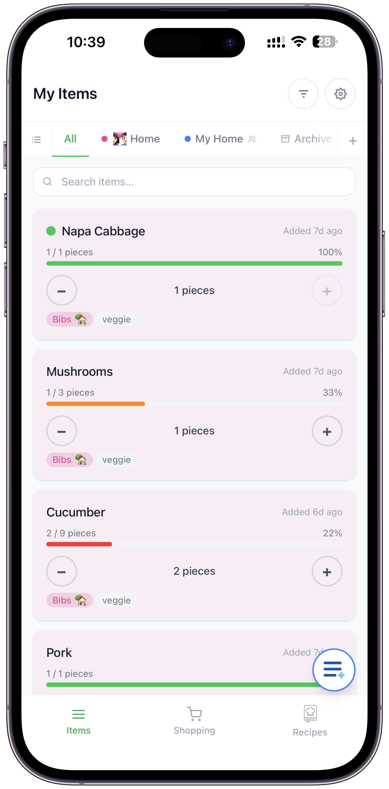
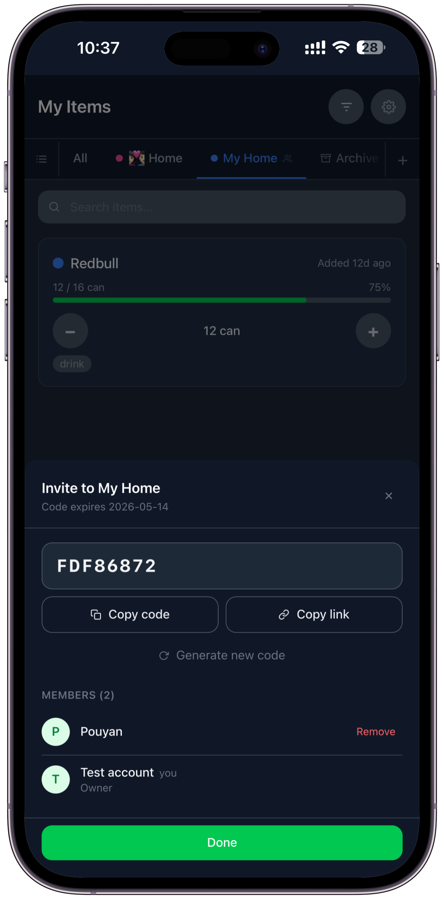
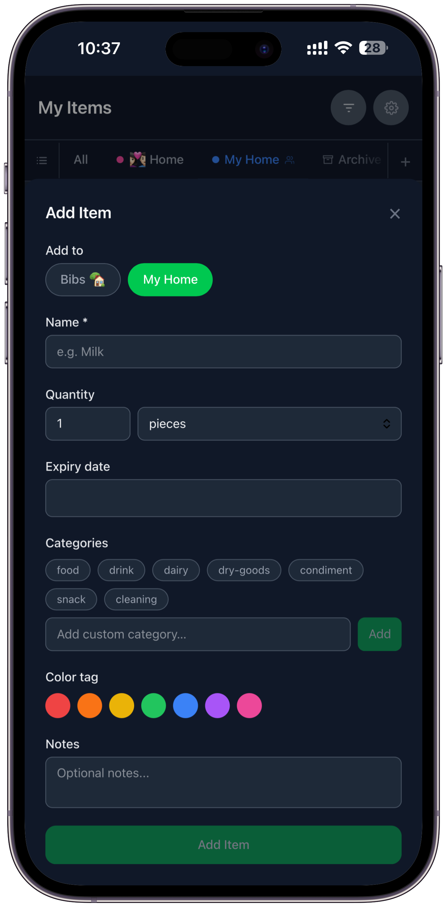

# Wastelessful

How many times have you thrown out food you forgot you had? Wastelessful lets you track items across locations, watch expiry dates, manage quantities, and keep a shopping list in sync with roommates or a partner.

---

## Screenshots

| Items | Shopping List | Recipe |
|:---:|:---:|:---:|
|  |  |  |

| light Mode | Group Management | Add Item |
|:---:|:---:|:---:|
|  |  |  |

---

## Features

- **Multi-group inventory** - organize items by location (Home, Office, Cabin, etc.) with color-coded tabs
- **Expiry tracking** - items are flagged as fresh, expiring soon, or expired based on a configurable threshold
- **Quantity management** - progress bar, one-tap reduce, low-quantity alerts
- **Smart shopping list** - items get auto-added when they're expiring or running low, with a link back to the source item
- **Shared groups** - invite people via a shareable code and changes sync in real time
- **Anonymous mode** - no account needed to get started; upgrade to Google or email later without losing anything
- **Offline-first** - installable PWA, works without internet via Firestore offline persistence
- **Dark mode** - system, light, or dark

---

## Tech Stack

| Layer | Technology |
|---|---|
| Frontend | React 19 + Vite + TypeScript + Tailwind CSS v4 |
| Database | Firebase Firestore (offline persistence enabled) |
| Auth | Firebase Authentication (anonymous + Google / email upgrade) |
| Hosting | Firebase Hosting |
| PWA | vite-plugin-pwa + Workbox |
| Testing | Vitest + React Testing Library |
| Routing | React Router v7 |

---

## How it works

**Dual-mode data layer** - anonymous users get a localStorage-backed store; authenticated users get Firestore real-time listeners. Both modes go through the same React context, so components don't need to care which one is active.

**Account upgrade without data loss** - when an anonymous user signs up, `linkWithCredential` keeps the same auth UID and a batched Firestore migration (chunked at 490 writes to stay under the limit) moves everything to the cloud.

**Real-time sync** - `onSnapshot` listeners for items, groups, shopping list, and recipes are all subscribed and torn down together when group membership changes, using a stable dependency key to avoid extra re-subscriptions.

---

## Getting Started

### Prerequisites

- Node.js 18+
- A Firebase project with Firestore and Authentication enabled

### Install

```bash
git clone https://github.com/pouyanfz/wastelessful.git
cd wastelessful
npm install
```

### Environment variables

Create `.env.local` in the root:

```env
VITE_FIREBASE_API_KEY=
VITE_FIREBASE_AUTH_DOMAIN=
VITE_FIREBASE_PROJECT_ID=
VITE_FIREBASE_STORAGE_BUCKET=
VITE_FIREBASE_MESSAGING_SENDER_ID=
VITE_FIREBASE_APP_ID=
```

Values come from Firebase: **Project Settings > Your apps > SDK setup**.

### Run locally

```bash
npm run dev
```

### Tests

```bash
npm test
```

### Build and deploy

```bash
npm run build
npx firebase-tools deploy
```

---

## Status

- [x] Phase 1 - Project setup
- [x] Phase 2 - TypeScript types, mock data, unit tests
- [x] Phase 3 - Full UI with mock data
- [x] Phase 4 - Firebase integration (Firestore helpers, real-time listeners)
- [x] Phase 5 - Auth (anonymous, Google/email, anon-to-real upgrade)
- [x] Phase 6 - Shared groups (invite codes, member management, join flow)
- [ ] Phase 7 - Polish (animations, app icon, haptics, loading skeletons)
- [ ] Phase 8 - PWA (service worker, install prompt, full offline)
- [ ] Phase 9 - Deploy to Firebase Hosting

---

## License

[MIT](LICENSE)
